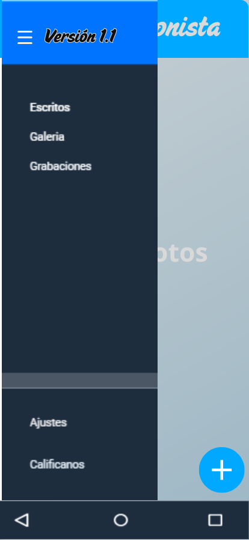
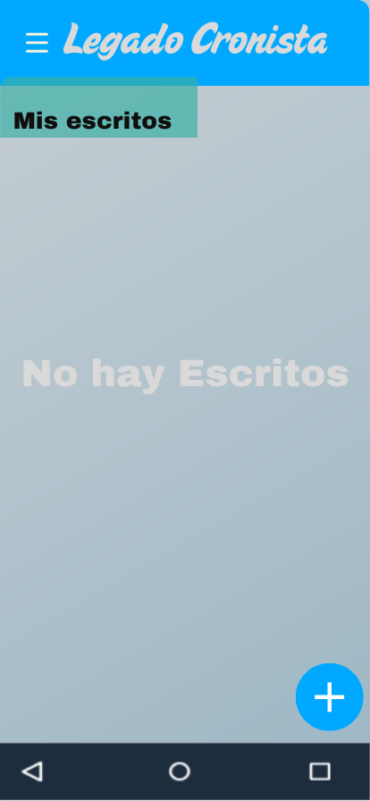
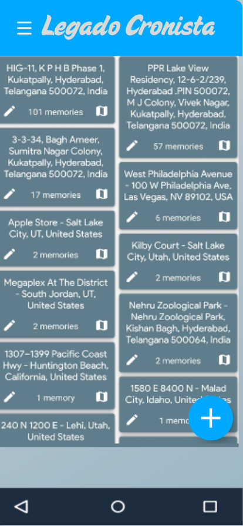
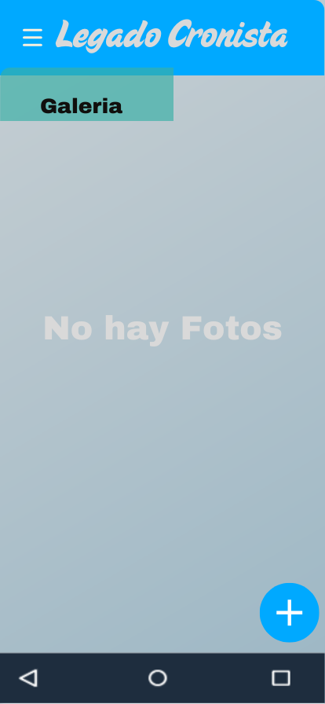
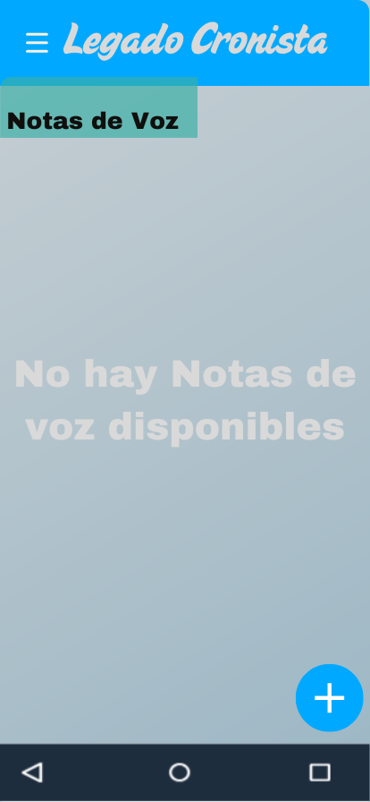
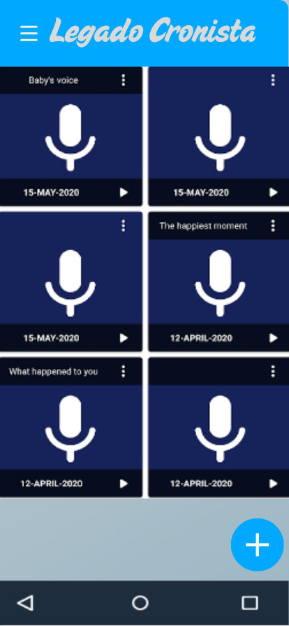
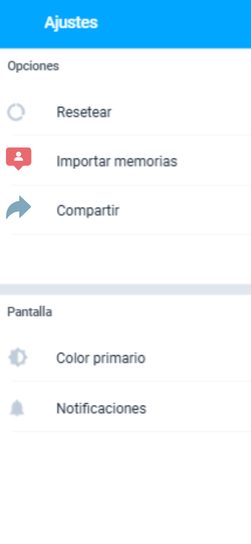
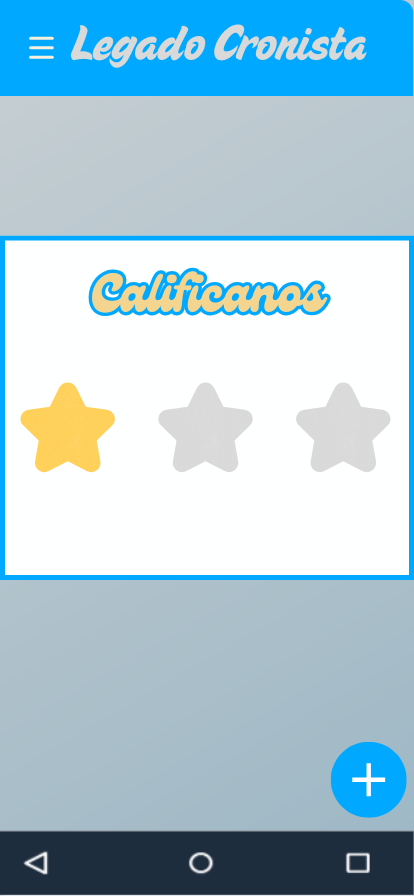

# Diseño de interfaz de usuario

La aplicación tendrá la siguientes pantallas

## 1. Pantalla 1  
Está pantalla es el menú donde se podra dezplazar entre  las siguientes pantallas 
  

## 2. Pantalla 2  
Está es la pantalla principal donde iniciara la aplicación, aqui se escribiran los textos, sin embargo asi se verá cuando este vacia 

  

## 3. Pantalla 3  
Está es la pantalla anterior sin embargo es su vista cuando este llena de archivos previamente ya escritos

  

## 4. Pantalla 4  
Está pantalla es el apartado para subir fotos, previamente ya tomadas

  

## 5. Pantalla 5  
Apartado para notas de voz cuando no haya notas de voz aún

  

## 6. Pantalla 6  
Apartado anterior con notas de voz 

  

## 7. Pantalla 7  
  
apartado de ajustes, sin embargo por el momento está abierto a cambios en sus opciones  

## 8. Pantalla 8  
 

Y finalmente esta ultima pantalla está hecha para que el usuario pueda calificar la aplicación y con esto saber como en posibles ocaciones modificarlo y en general para saber la satifacciopn del usuario 
# Referencias

- [Material Design: Foundations](https://m3.material.io/foundations)
- [Material Design: Style](https://m3.material.io/styles)
